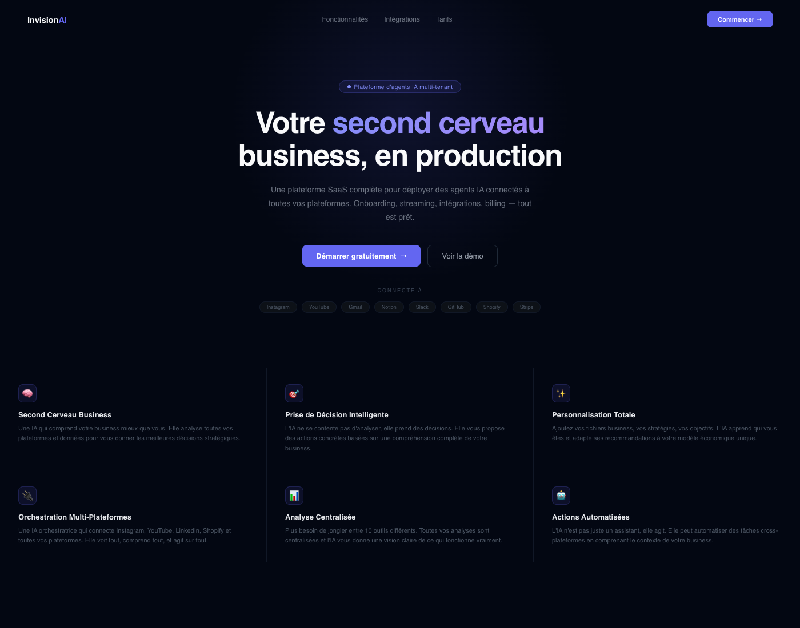

<div align="center">

# Invision AI

**A multi-tenant AI agent platform for businesses — onboarding, chat, integrations, and usage tracking out of the box.**

[](https://nextjs.org)
[](https://www.typescriptlang.org)
[](https://prisma.io)
[](https://trpc.io)
[](https://langchain.com)
[](LICENSE)

</div>

<div align="center">

</div>

---

## What it is

Invision AI is a production-ready SaaS foundation for teams that want to ship **AI agents with real integrations** — not toy chatbots. It combines multi-tenant organizations, an onboarding flow that auto-bootstraps resources, a streaming chat UI wired to LangChain, external platform connectors through Composio, and per-user API credit tracking for billing.

Think of it as the plumbing you'd otherwise rebuild for the 10th time, already wired, typed end-to-end, and deployable via a single Railway push.

## Features

| | |
|---|---|
| 🏢 **Multi-tenant** | Organizations · Teams · Members · Roles · Invitations |
| 🤖 **Agent runtime** | LangChain agents with streaming, memory, tools, and prompt versioning |
| 💬 **Chat v2** | Streaming SSE, session persistence, typed messages |
| 🔌 **Integrations** | YouTube · Instagram · Composio (Gmail, Slack, Notion, GitHub, ...) |
| 📚 **Business resources** | Import docs (DOCX/CSV/audio), auto-extract context for agents |
| 🧭 **Onboarding** | Multi-step wizard, auto-creates resources from onboarding data |
| 💳 **Usage tracking** | Per-user API credit consumption, ready for metered billing |
| 👑 **Admin** | User management, ban/unban, usage dashboards, impersonation-ready |
| 🔐 **Auth** | Better Auth + Prisma, OAuth (GitHub), email/password, session management |
| 🌍 **i18n** | `next-intl`, dark/light theme, `next-themes` |

## Tech stack

| Layer | Choice | Why |
|---|---|---|
| **Framework** | Next.js 15 (App Router, Turbo) | RSC, server actions, streaming |
| **Styling** | Tailwind + shadcn/ui (Radix) | Composable primitives, design tokens |
| **API** | tRPC 11 | End-to-end type safety, zero-codegen |
| **DB** | PostgreSQL + Prisma 6 | Schema-first, migrations, typed client |
| **Auth** | Better Auth | Modern, framework-native, session-based |
| **AI** | LangChain 1.2 · Anthropic · OpenAI | Agents, tools, streaming, memory |
| **Integrations** | Composio | 200+ third-party APIs through one SDK |
| **Deploy** | Docker · Railway · Vercel | `git push` to prod |

## Architecture

```
┌──────────────────────────┐       ┌──────────────────────────┐
│  Next.js App Router      │       │  tRPC Routers            │
│  • RSC pages             │──────▶│  admin · chat-v2         │
│  • Streaming chat UI     │       │  integrations · org      │
│  • Onboarding wizard     │       │  onboarding · resources  │
└──────────────────────────┘       │  youtube · instagram     │
                                   └────────────┬─────────────┘
                                                │
                          ┌─────────────────────┴─────────────────────┐
                          ▼                     ▼                     ▼
                ┌──────────────────┐  ┌──────────────────┐  ┌─────────────────┐
                │ LangChain agents │  │   Prisma / PG    │  │    Composio     │
                │ • tools          │  │  • multi-tenant  │  │  200+ APIs      │
                │ • memory         │  │  • RBAC          │  │  OAuth flows    │
                │ • streaming      │  │  • usage meter   │  │                 │
                └──────────────────┘  └──────────────────┘  └─────────────────┘
```

## Getting started

**Prerequisites**: Node 20+, pnpm/npm, Docker (optional), PostgreSQL (or Docker Compose).

```bash
git clone https://github.com/thomasetienne/invision-ai.git
cd invision-ai
cp .env.example .env         # fill in the required keys
npm install
npm run db:generate          # prisma migrate dev
npm run dev                  # http://localhost:3000
```

Create your first admin user:

```bash
npm run create-admin admin@example.com mypassword "Admin"
```

### Environment variables

All keys are documented in [`.env.example`](.env.example). Minimum to boot:

- `DATABASE_URL` — PostgreSQL connection
- `BETTER_AUTH_SECRET` — 32+ chars, `openssl rand -base64 32`
- `BETTER_AUTH_URL` — your public URL
- `COMPOSIO_API_KEY` — for external integrations

## Deployment

### Railway (recommended)

```bash
# Push to a GitHub repo connected to Railway → that's it.
# The included Dockerfile + railway.json handle the rest.
```

See [`README.DOCKER.md`](README.DOCKER.md) for Docker Compose and Make targets (`make up`, `make logs`, `make prisma-studio`, ...).

### Vercel

```bash
vercel --prod
```

You'll need an external PostgreSQL (Neon, Supabase, Railway addon).

## Project structure

```
src/
├── app/                    # Next.js App Router
│   ├── api/                # REST endpoints (chat, auth, integrations, webhooks)
│   ├── auth/               # Sign-in / sign-up
│   ├── dashboard/          # App shell (chat, admin, integrations, org, resources)
│   └── onboarding/         # Multi-step wizard
├── components/             # UI components (shadcn/ui + custom)
├── server/
│   ├── api/routers/        # tRPC routers (1 file per domain)
│   ├── services/
│   │   └── langchain-agents/   # Agent runtime: tools, memory, prompts, streaming
│   └── better-auth/        # Auth configuration
└── trpc/                   # Client-side tRPC wiring
prisma/
└── schema.prisma           # 18 models: User, Organization, Member, ApiUsage, ...
```

## Scripts

| Command | Purpose |
|---|---|
| `npm run dev` | Dev server (Turbo) |
| `npm run check` | Lint + typecheck |
| `npm run db:studio` | Prisma Studio |
| `npm run test:e2e` | E2E suite (route security · YouTube · chat quality) |
| `npm run create-admin` | Seed first admin |
| `make up` | Docker stack |

## Security

The pre-commit hook (`lint-staged` + Prisma format) and pre-push hook (`lint` + `typecheck` + `prisma validate`) enforce quality gates before anything lands on a branch. An E2E suite specifically checks **route-level authorization** (`tests/e2e/route-security.test.js`) to prevent IDOR and unauthorized access across the multi-tenant boundary.

## Status

Invision AI is **actively developed**. This repository is the public reference implementation extracted from a production codebase — it prioritizes clarity over feature completeness. Some integrations are wired as examples; extending them is intentionally straightforward.

## License

[MIT](LICENSE) — do whatever, just don't blame me if it catches fire.

---

<div align="center">

Built by [@thomasetienne](https://github.com/thomasetienne) · [axiom.trade/@talt](https://axiom.trade/@talt)

</div>
